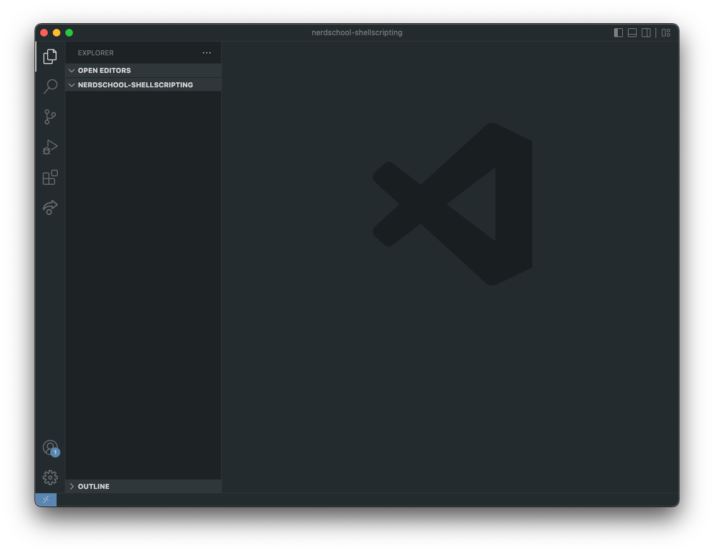
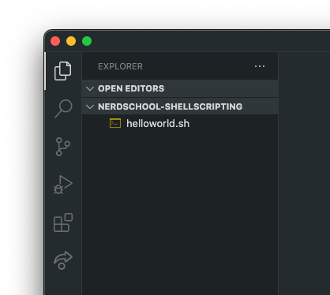

# Exercise 3 - Scripting

You will learn to:

- Create and execute simple bash scripts
- Add scripts to the `$PATH`

## Required software and tools for this exercise

- Bash
- Visual Studio Code

---

### 3.1 Install required software

:book: We are going to be using [Visual Studio Code](https://code.visualstudio.com/) to create and edit script files.

Note: You can use any text editor of your choice. VSCode is a simple alternative, because you can navigate to any directory in the command line and open that directory in VSCode using the `code .` command (the dot `.` means "here, this directory").

:pencil2: Install Visual Studio Code by following [these instructions](https://code.visualstudio.com/docs/setup/setup-overview).
Alternative: Install the [Cursor IDE](https://www.cursor.com/), which is based on Visual Studio Code.

### 3.2 Workspace setup

:book: Before we start, you need to create a temporary folder that will be your workspace for this workshop. Creating a folder inside your user "home" folder is the easiest way.

:pencil2: Open a terminal.

:book: By default, `bash` will set the current working directory to the value of the global environment variable `$HOME`, which will vary by OS:

- Linux: `/home/<username>`
- macOS and Windows (Git Bash): `/Users/<username>`

:pencil2: To print the current working directory (which should be your home folder), use the `pwd` command.

:pencil2: Create a subfolder of your home directory called `techschool-shellscripting` by using the `mkdir` command.

:pencil2: Change the working directory to this folder using the `cd` command. `pwd` should now output `<homefolder>/techschool-shellscripting`.

:pencil2: To open this folder as your workspace folder inside VS Code, you can launch VS Code from the command line using the `code .` command.

:exclamation: macOS-users need to follow an one-time [additional VS Code setup step](https://code.visualstudio.com/docs/setup/mac#_launching-from-the-command-line) to add the `code` command to `$PATH`.

:exclamation: If you receive a warning saying "Do you trust the authors of the files in this folder?", press "Yes, i trust the authors".

The result should be something like this:



### 3.3 Hello world script

:book: Notice that the left side Explorer pane of VS Code is empty, because the folder you opened is empty. To create a empty file using the command line, use the command `touch <filename>`.

:pencil2: Create a file called `helloworld.sh` using the `touch` command.

:book: In VS Code, notice that you now have a file in the Explorer pane:



:book: You can of course also create files directly inside VS Code.

:pencil2: Update the contents of `helloworld.sh` with the following using VS Code:

```bash
#!/bin/bash
MESSAGE="Hello World!"
echo "$MESSAGE"
```

:exclamation: Remember to save your file.

:book: The first line in the script above is something called a "shebang": `#!/bin/bash`. It sets the target shell to be used when executing the script. The shebang is not strictly required when creating shell scripts, but is a recommended best practice. Omitting it can some times lead to compatibility issues, as some shells have different scripting syntax than others.

:book: The last two lines in the script assigns a value to a local variable and outputs it.

#### 3.3.1 Executing scripts

:book: To execute a script, use the syntax `./<scriptname.sh>`.

:pencil2: Try executing your `helloworld.sh` script this way.

:book: The command should output an error.

```bash
bash: ./helloworld.sh: Permission denied
```

:exclamation: If you are using Windows with barebone git bash, you shell might not honor best practice and the file may be executable from the get-go. This should not be a problem with WSL or any real Unix-like system. Try to follow along anyway, as permissions is an important aspect of working with files, that you will encounter when you are working in a non-emulated unix environment.

:book: In order for a script to be executable, you need to set the _file permissons_ for the script file correctly.

#### 3.3.2 File permissions

:book: In Unix shells, scripts and programs (binaries) are both _files_. To be able to execute a script or a program, the correct file permissions must be set.

:bulb: See [Addendum - File permissions](file_permissions.md) learn more about file permissions.

:exclamation: Be careful when setting file permissions, as the wrong file permissions on the wrong set of files can lead to unintended access to your system.

:book: We use the `chmod` command to set the permissions of files. To add the execute (`x`) permission to a file for the file owner, you can use the syntax `chmod u+x <filename>`.

:pencil2: Add execute permissions for everyone to the file `helloworld.sh`.

:pencil2: Check that the permissions are correct using the `ls -l` command. The leftmost characters on each line represents the file permission settings. The correct result should be `rwxr--r--`.

:pencil2: Try executing the script again using the `./<filename>` syntax.

:book: The script should now output:

```bash
Hello World!
```

### 3.4 Accessing command-line arguments

You can access command-line arguments in a script by using the `$1`, `$2`, `$3` etc. variables. `$1` is the first argument, `$2` is the second argument, and so on. To check the number of arguments passed to the script, you can use the `$#` variable.

Example:

```bash
#!/bin/bash
echo "You have passed $# arguments"
echo "The first argument is $1"
echo "The second argument is $2"
```

:pencil2: Create a new file, save it as `args.sh`, set execution permissions for it. Now run `./args.sh abc ddd`. You should see output

```
You have passed 2 arguments
The first argument is abc
The second argument is ddd
```

:pencil2: Modify the `args.sh` script so that it takes two arguments and prints the following output: `You are executing the script with the following arguments: <first_argument> <second_argument>`. Save the script as `args.sh`, set execution permissions for it. Now run `./args.sh Chuck Norris`. You should see output `You are executing the script with the following arguments: Chuck Norris`.

### 3.5 Conditional statements

Scripts are simply a list of commands. However, these commands can include some logic as well. Let's look at two possible logic constructions: for-loops and if-statements.

#### 3.5.1 For-loops

If you are familiar with programming, you have seen for-loops. Essentially, a loop is a construct which repeats a piece of code several times. In Bash, the syntax of a for-loop is as follows:

```bash
for <variable> in <list>
do
  # Some code here - this will be repeated
  # for each value in the list
done
```

The `list` is a list of values. In the simplest case, it can be a space-separated value list, such as `1 2 3 4` or `green yellow red banana`.

For example:

```bash
for i in 1 2 3 4
do
  echo "i is $i"
done
```

This will print the following output:

```
i is 1
i is 2
i is 3
i is 4
```

You can mix values of different types as well:

```bash
for i in 1 2 green yellow -3
do
  echo "i is $i"
done
```

:exclamation: Note that `i` is written simply as `i` in the `for i in ...`, because here you assign value to variable `i`, while in the `echo` command it is written as `$i`, because you read the value of variable `i`.

The `<list>` can be output of another command also. In that case you need to enclose the command in `$()`. Example, to iterate over all the names of files inside the local directory

```bash
for filename in $(ls)
do
  echo $filename
done
```

There is a simpler way to iterate over all the files in a directory. You can use the `*` wildcard character to match all files in a directory. For example, `ls *` will list all files in the current directory.

```bash
for filename in *
do
  echo $filename
done
```

You can replace the `*` wildcard with a specific directory path. For example, to iterate over all the files in the `/home/user/techschool-shellscripting` directory, you can use `for filename in /home/user/techschool-shellscripting/*`.

The `seq` command generates a sequence of values. For example, `seq 1 4` generates values `1 2 3 4`; `seq 2 14 4` generates values from 2 to 14 with step 4, i.e., `2 6 19 14`.

:pencil2: What do you think will be printed to the terminal by this script?

```bash
#!/bin/bash
for i in  $(seq 2 3 9)
do
  echo "i is $i"
done
```

:bulb: Curios to find out? Copy the content of this script, save it as a file, give it execution permissions and run it!

You can nest for loops inside each other, for example:

```bash
for i in  $(seq 1 4)
do
  for j in $(seq 1 $i)
  do
    echo "$i $j"
  done
done
```

:pencil2: What will this script print out?

You can even use fancy C-style for loops in bash:

```bash
for ((i=1; i < 10; i++))
do
  echo $i
done
```

There are different ways you can write for-loops in bash. Some syntax variants are added in later versions of bash and will not work on macOS by default (unless you update bash). Check out different examples in [this article](https://www.cyberciti.biz/faq/bash-for-loop/).

:pencil2: Create a bash script with a for loop which prints the following:

```
red
green
blue
```

:pencil2: Create a bash script with a for loop which prints the following:

```
The number is 2
The number is 3
The number is 4
The number is 5
The number is 6
```

:pencil2: Create a bash script with a for loop and a `seq` command which prints the following:

```
The number is 2
The number is 4
The number is 6
The number is 8
The number is 10
```

#### 3.5.2 If-statements

Sometimes you want to have branching in your script - if a condition is true, do one thing, otherwise do something else. The general syntax for if-statements in bash:

```bash
if [ condition ]; then
   # commands to execute when condition is true
else
   # commands to execute when condition is false
fi
```

The else part is optional, this also works:

```bash
if [ condition ]; then
   # commands to execute when condition is true
fi
```

You can combine several conditions with else-if blocks as follows:

```bash
if [ condition1 ]; then
   # commands to execute when condition1 is true
elif [condition2 ]; then
   # commands to execute when condition2 is true
elif [condition3 ]; then
   # commands to execute when condition3 is true
   # ... and so on
else
   # commands to execute when none of the conditions above are true
fi
```

As always, the devil is in the details. Here the devil is the specific syntax of conditions. Depending on the bash version, different condition syntax is possible. Examples:

```bash
num=10

num=0

if [ "$num" -gt 0 ]; then
    echo "Positive"
elif [ "$num" -lt 0 ]; then
    echo "Negative"
else
    echo "Zero"
fi

s="hello"

if [ "$s" = "hello" ]; then
    echo "String matches"
fi

file="data.txt"
# file=/home/users/girts

if [ -d "$file" ]; then
    echo "$file exists and is a directory"
elif [ -f "$file" ]; then
    echo "File exists"
else
    echo "File does not exist"
fi

if [ -f "$file" ] && [ -w "$file" ]; then
    echo "File is writable"
else
    echo "File is missing or not writable"
fi
```

:pencil2: Write a bash script `arg_check.sh` that checks whether the script is executed with an argument. If it is, print `The argument is <argument>`. If it is not, print `No argument provided`.

:pencil2: Write a bash script `args.sh` that takes two arguments and prints them in the following format: `You are executing the script with the following arguments: <first_argument> and  <second_argument>`. If one or both arguments are missing, print `You must provide two arguments for the script to work`.

:pencil2: Modify the `args.sh` script you created before. If the first argument for the command is `Chuck`, print `There are no arguments with Chuck` instead of the default message.

#### 3.5.3 Functions in Bash

When you want to reuse a piece of code, you can define a function with some code body. Then you can call that function as many times as you want in the code. This is the same as all other functions in other programming languages. You define a function by using the `function` keyword. Then you call the function by its name.
Example:

```bash
function hello() {
  echo "Hello, world!"
}

hello
hello
hello
```

The function can also take arguments. You can then access the arguments by using the `$1`, `$2`, `$3` etc. variables.

```bash
function hello() {
  echo "Hello, $1!"
}

hello Chuck
hello John
```

Note: The `echo` command is used to return a value from a function.

:pencil2: Write a script `sum.sh` that defines a function `sum` and calls it with arguments 1 and 2. The function should return the sum of the two arguments.

A function can also return a value. You can do this by using the `return` keyword. The value returned by the function is then available using the `$?` variable.

```bash
function square() {
  echo $(($1 * $1))
}

square 2
echo $?
```

You can also store the return value of a function in a variable.

```bash
function square() {
  echo $(($1 * $1))
}

n=$(square 7)
echo $n
```

The value can be used in arithmetic expressions as well.

```bash
function square() {
  echo $(($1 * $1))
}

n=$(square 7)
echo $((n + 1))
## Or like this:
echo $(( $(square 7) + 1 ))
```

:pencil2: Write a script `largest.sh` that defines a function `largest` and calls it with arguments 10 and 20. The function should return the largest of the two arguments.

:pencil2: Call the `largest` function with arguments from the command line and print the result.

:pencil2: Add an if-statement which check whether two command-line arguments are provided. If not, print `You must provide two arguments for the script to work`.

#### 3.5.4 Combining for-loops and if-statements

:pencil2: Write a script `even_numbers.sh` that prints out all even numbers between 1 and 20.

:bulb: you can check whether number `i` is an even number, by checking whether the remainder of division by two is zero in the following way: `if [ $((i % 2)) -eq 0 ]; then`.

:bulb: The `$(())` is used to write arithmetic expressions. See [this article](https://ryanstutorials.net/bash-scripting-tutorial/bash-arithmetic.php) for more arithmetic options.

:pencil2: Write a script `even_numbers_between.sh` that takes two arguments and prints out all even numbers between the two arguments. Run that script with arguments 13 and 19

:pencil2: Write a script `is_prime.sh` that takes one argument and checks if the argument is a prime number. It prints `Prime` if the number is prime, and `Not prime` if the number is not prime. Hint: a prime number is a number which is divisible only by 1 and itself.

:star: Bonus challenge: stop checking the divisibility when you first encounter a number that is a divisor of the given number. :bulb: Hint: you can use the `break` keyword to stop a loop.

:star: Bonus challenge: write a function `sqrt` which calculates the square root of a number, rounded down to the nearest integer. You can then test divisibility of the given number by all numbers in the range 2..sqrt(n).

:star: Bonus challenge: write a script `primes.sh` which prints out all prime numbers between 1 and 100. :bulb: Hint: you can use the `is_prime.sh` script you created before, just modify it to echo 1 when the passed argument is a prime number, and 0 otherwise, remove all other echoes.

#### 3.5.5 More scripting exercises

:book: These tasks require you to create bash scripts that you can execute in your shell. Remember to set the correct file permissions on each script file you create.

:pencil2: Make a script that uses a for loop to print out the first few lines of each file in a directory.

:pencil2: Make a variable containing the path of a directory or a file that exists in your filesystem.
Make a test that checks whether the path is a directory or a regular file. Print `Directory` if the path is a directory, or `File` if the path is a regular file. Create a script that you can run to check the status of the path currently stored in your variable (e.g. `./filecheck.sh`).

:star: Bonus: Instead of storing the path of the file or folder you want to check, can you pass it inn as an argument to the script? (E.g. `./filecheck.sh /home/myfolder`).

:star: Bonus: Are you able to use the variable containing the file or directory, printing the path of the file in the output? E.g. `"/home/root/file.txt" is a file`.

---

### 3.6 - Adding scripts to the $PATH

:book: If you create a script you want to use without executing it from the directory it is located in, you can add the script directory to the `$PATH` variable. Like we discussed in the previous exercise, the `$PATH` is set at startup and can be overridden using a `.bashrc` configuration file in the home directory.

:pencil2: Change the current directory to the home directory using `cd ~`. (`~` is an alias of the path to the current user´s home directory)

:pencil2: Check to see if you have a file called `.bashrc` in your home directory. Create a new empty file in the home directory called `.bashrc` if it does not already exist.

:exclamation: Notice that if you list the contents of the home directory the `.bashrc` file is hidden. This is because of the `.` prefix in the filename, which tells the OS to hide the file. To list hidden files using `ls` you can use the `-a` parameter.

:pencil2: Open the `.bashrc` file in VS Code using the `code` command and add the following:

```bash
export PATH=~/techschool-shellscripting:$PATH
```

Notice that we use `export` to create a environment variable.

:question: Why is `PATH` assigned the value of `$PATH`?

:exclamation: If we redefine `PATH` by doing `export PATH=/some/dir`, we loose the exiting value if we don't append it to the new value. Not retaining the predefined value of `$PATH` will cause the shell to not find any of the essential commands like `ls` and `cp`, which causes problems.

:pencil2: The `.bashrc` file is only read at startup, so to see if the `$PATH` was updated you need to start a new bash shell.

:pencil2: Try echoing out the value of `$PATH` to see if it includes the new directory we added.

:pencil2: Try executing some of the scripts inside the `techschool-shellscripting` directory by typing `<scriptname.sh>` while the current directory is any other directory.

### [Go to exercise 4 :arrow_right:](./exercise-4.md)
